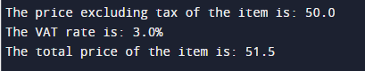

## Description
An illustrative Java class example showcasing the computation of total prices derived from initial prices and VAT rates, demonstrating basic price calculation functionalities within a class structure.
## Output

